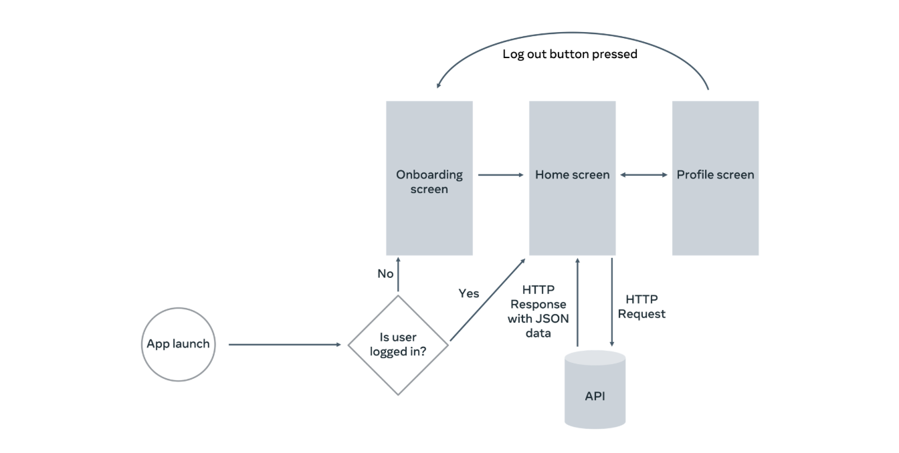

# Little Lemon App

A small React Native demo app for a restaurant-style onboarding and profile flow. The app shows a compact header, onboarding screen, profile editing (with masked phone input), and a reusable button component.


## Scenario 




## Features

- Onboarding with form validation (name + email) and Next button in the footer
- Profile screen with editable fields: First name, Family name, Email, Phone (US mask)
- Avatar with initials fallback when no image is uploaded
- Notification preferences (checkboxes)
- Persistent profile saved to device using AsyncStorage
- Reusable `AppButton` component for consistent buttons across screens
- **SQLite Integration**: Menu data persisted locally for fast offline access
- **Cold-start Optimization**: Loads from local DB on subsequent app launches, fetches remote API only when needed
- **Debounced Search**: Search queries are debounced by 500ms to minimize database hits while typing, improving performance and UX

## Debounced Search Feature

The app implements a performance-optimized search feature that minimizes database queries and unnecessary re-renders while users type. When a user enters text in the search field, the search operation is **debounced** for 500 milliseconds — meaning the database query only executes after the user pauses typing for half a second.

**How It Works:**

1. User types in the search input field → `query` state updates instantly (provides immediate visual feedback).
2. A custom `useDebounce` hook delays the actual search value (`debouncedQuery`) by 500ms.
3. Every keystroke resets the 500ms timer; if the user pauses, the timer completes.
4. Once 500ms elapses without typing, `debouncedQuery` updates and triggers a search effect.
5. The `useEffect` runs `searchItemsByText(db, debouncedQuery)` to query the SQLite database.
6. Results are mapped to UI format and displayed in the menu list.
7. If the search field is empty, all items are reloaded.

**Benefits:**

- **Performance**: Reduces database queries from ~1 per keystroke to ~1 per word (e.g., typing "salad" = 1 query instead of 5).
- **Smooth UI**: Input responds instantly; search happens after the user finishes typing.
- **Battery & Network Efficient**: Fewer queries mean less CPU and I/O on the device.
- **Better UX**: Avoids flickering results while typing and shows final results only once.

**Technical Implementation:**

- **`useDebounce` hook**: A reusable React hook that wraps any value and delays its update.
  - Uses `useRef` to maintain a timer reference.
  - Clears and restarts the timer on every input change.
  - Returns the delayed value after the timeout completes.

- **Debounce delay**: 500ms (configurable; lower for faster, higher for more conservative queries).

- **Search source**: SQLite local database (via `searchItemsByText(db, query)`) — fast, offline-capable, and persistent across app launches.

## Cold-Start Flow

**First Launch (Fresh Install):**

```text
App Start
  ↓
SQLiteBootstrap (ensure DB table exists)
  ↓
Home Screen opens
  ↓
DB empty? Yes
  ↓
Fetch Remote API (menu.json)
  ↓
Insert rows into SQLite ← Background seeding
  ↓
Display UI from Remote Data (fast)
  ↓
Next cold start will load from DB
```

**Subsequent Launches (DB has data):**

```text
App Start
  ↓
SQLiteBootstrap (ensure DB table exists)
  ↓
Home Screen opens
  ↓
DB empty? No
  ↓
Load rows from SQLite (instant, no network)
  ↓
Display UI from Local Data
  ↓
User interaction (search, filter, order)
```

**If DB Fails:**

```text
Home Screen
  ↓
ensureMenuTable(db) fails / DB unavailable
  ↓
Fallback to Remote API fetch
  ↓
Display UI, retry DB seeding in background
```

## Screenshots

Logo / Splash


Hero / Home (example)


Profile (avatar & edit)


Food / content examples


## Running

1. Install dependencies: `npm install` or `yarn`
2. Start the Metro bundler: `npx react-native start`
3. Run on Android: `npx react-native run-android` or iOS: `npx react-native run-ios`

Notes:
- This project uses `react-native-mask-text` for phone masking and `@react-native-async-storage/async-storage` for simple persistence.
- If you want me to add screenshots of other screens or change the README tone, tell me which images or wording you prefer.


